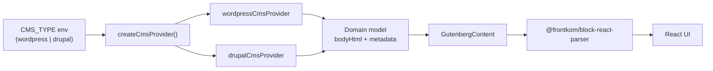

# ArtSpace

A headless contemporary art gallery built with **Next.js**. One frontend, multiple CMS backends — the React layer never knows which CMS serves the content.

> **Active development.** This repository is public while the project is still being built out. Features, APIs, and documentation may change between releases. See [Implementation status](#implementation-status) below.

---

## What it is

ArtSpace demonstrates a **Strategy-pattern CMS layer**: the same gallery UI runs against **WordPress REST** or **Drupal JSON:API**, selected per deployment via a single environment flag (`CMS_TYPE`). Gallery content (artworks, artists, exhibitions) flows through a normalized domain model; rich text is stored as Gutenberg HTML and rendered through a stable `<GutenbergContent />` component.

Artwork images may use open-access URLs from the [Art Institute of Chicago API](https://api.artic.edu/docs/) (IIIF), with an optional seed script to refresh URLs in fixtures.

CMS backends are **not** part of this repo — development uses fixtures that mirror real API response shapes, with optional live fetch when base URLs are configured.

---

## Architecture



### Stable seams

Public APIs are fixed early; implementations mature in code between stages — not via env toggles.

| Seam       | Stable API                         | Current implementation                                |
| ---------- | ---------------------------------- | ----------------------------------------------------- |
| CMS        | `CMSProvider` + `getCmsProvider()` | Fixture-based adapters with optional live fetch       |
| Gutenberg  | `<GutenbergContent body={…} />`    | Frontkom `block-react-parser` + custom block handlers |
| i18n       | `t("…")`                           | Identity (returns key as-is)                          |
| Plain text | `extractPlainText(html)`           | HTML strip for AI / metadata                          |
| Media      | `getMediaProvider()`               | AIC IIIF resolution + CMS URL helpers                 |
| AI         | `getLlmProvider()`                 | Mock stream (chat UI planned)                         |

**Rule:** feature code imports only stable APIs. Parser internals stay behind `GutenbergContent`.

---

## Implementation status

Development follows a staged plan in [`docs/`](docs/README.md). Summary:

| Stage | Focus                                                                  | Status          |
| ----- | ---------------------------------------------------------------------- | --------------- |
| **0** | Foundation — Next.js shell, tooling, providers, design tokens          | **Done**        |
| **1** | Domain model, `CMSProvider` Strategy, WP/Drupal fixtures, stable seams | **Done**        |
| **2** | Frontkom Gutenberg parser, live CMS fetch, AIC media, `CmsImage`       | **Done**        |
| **3** | UI polish — theme toggle, motion, responsive grid refinements, README  | **In progress** |
| **4** | AI Q&A assistant — `/api/chat`, grounded context, chat widget          | **Planned**     |

### Completed so far

- Next.js 16 App Router, React 19, TypeScript strict, Tailwind CSS 4, TanStack Query 5, Zod 4
- `CMSProvider` with WordPress and Drupal adapters, Zod validation at the boundary
- Authentic fixture files (real API shapes + Gutenberg block comments)
- Gutenberg rendering via `@frontkom/block-react-parser` and shared block handlers
- Gallery routes: `/artworks`, `/artists`, `/exhibitions` (list + detail)
- Error boundaries, Suspense skeletons, `CmsNotFoundError` → `notFound()`
- Optional live CMS fetch (`WP_API_URL`, `DRUPAL_BASE_URL`) with fixture fallback
- Media provider for AIC IIIF URLs; `npm run seed:media` for fixture URL refresh
- Layout shell: header, footer, skip link, responsive navigation

### Still planned

- **Stage 3:** `next-themes` manual dark/light toggle, Framer Motion page/grid animations, final visual polish
- **Stage 4:** Vercel AI SDK provider, `/api/chat` route, floating chat widget grounded in CMS content

---

## Tech stack

| Layer         | Technology                               |
| ------------- | ---------------------------------------- |
| Framework     | Next.js 16 (App Router) + React Compiler |
| UI            | React 19                                 |
| Language      | TypeScript (strict)                      |
| Styling       | Tailwind CSS 4                           |
| Server state  | TanStack Query 5                         |
| Validation    | Zod 4                                    |
| Gutenberg     | `@frontkom/block-react-parser`           |
| Lint / format | ESLint 9 + Prettier                      |

Full staged guide: [`docs/README.md`](docs/README.md).

---

## Getting started

```bash
git clone git@github.com:pi81/artspace.git
cd artspace
npm install
cp .env.example .env.local   # optional — defaults work with fixtures
npm run dev
```

Open [http://localhost:3000](http://localhost:3000).

### Scripts

| Command              | Purpose                                     |
| -------------------- | ------------------------------------------- |
| `npm run dev`        | Development server                          |
| `npm run build`      | Production build                            |
| `npm run typecheck`  | TypeScript check                            |
| `npm run lint`       | ESLint                                      |
| `npm run format`     | Prettier (src)                              |
| `npm run seed:media` | Refresh AIC IIIF URLs in fixture JSON files |

---

## Environment variables

| Variable          | Required                  | Values                  | Purpose                                          |
| ----------------- | ------------------------- | ----------------------- | ------------------------------------------------ |
| `CMS_TYPE`        | No (default: `wordpress`) | `wordpress` \| `drupal` | Which CMS adapter serves this deployment         |
| `WP_API_URL`      | No                        | Site URL                | Live WordPress fetch; omit to use fixtures       |
| `DRUPAL_BASE_URL` | No                        | Site URL                | Live Drupal JSON:API fetch; omit to use fixtures |

`CMS_TYPE` is server-only — no `NEXT_PUBLIC_` prefix.

Switching CMS requires no code changes:

```bash
# .env.local
CMS_TYPE=wordpress
# or
CMS_TYPE=drupal
```

---

## Project structure

```text
src/
  app/                    # App Router — thin route files
  api/                    # getCmsProvider, query factories, withSignal
  components/             # ui/, layout/, errors/
  features/gallery/       # Domain UI (grids, detail views, header)
  hooks/                  # Thin TanStack Query wrappers
  lib/
    cms/                  # Strategy layer — adapters, schemas, fixtures
    cms/content/gutenberg # GutenbergContent + block handlers
    cms/media/            # AIC media provider
    ai/                   # LLM seam + content retriever (Stage 4)
    i18n/                 # t() identity impl
  providers/              # QueryClient + AppProvider
docs/                     # Staged implementation guide
scripts/                  # seed-media.ts
```

---

## License

Private project — see repository settings for usage terms.
